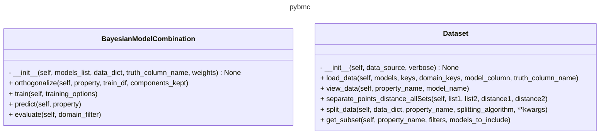

```mermaid
---
title: pybmc
---
classDiagram
    class BayesianModelCombination {
        - \_\_init__(self, models_list, data_dict, truth_column_name, weights) None
        + orthogonalize(self, property, train_df, components_kept)
        + train(self, training_options)
        + predict(self, property)
        + evaluate(self, domain_filter)
    }

    class Dataset {
        - \_\_init__(self, data_source, verbose) None
        + load_data(self, models, keys, domain_keys, model_column, truth_column_name)
        + view_data(self, property_name, model_name)
        + separate_points_distance_allSets(self, list1, list2, distance1, distance2)
        + split_data(self, data_dict, property_name, splitting_algorithm, **kwargs)
        + get_subset(self, property_name, filters, models_to_include)
    }
```
